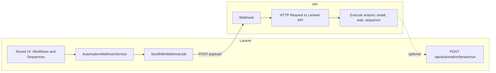
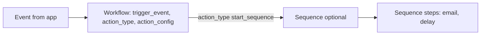

# Automation & n8n Integration — What We Have Done

This document describes the **current implementation** of the Automation module and its integration with n8n. It is the single reference for what exists in code today: events, services, jobs, payloads, tenant UI (workflows, sequences, logs), inbound API for n8n, and how to test.

---

## 1. Overview

- **Laravel** emits events when certain actions happen (lead created, funnel opt-in, lead status changed, payment paid/failed). Each event is sent to **n8n** via an HTTP POST to a configurable webhook URL.
- All outbound webhook logic is **centralized** in one service and one job. Payloads follow a **consistent shape** so n8n workflows can rely on the same structure for every trigger.
- Webhooks are sent **asynchronously** (queued) so the user request is not blocked.
- **Idempotency** is supported via a unique `event_id` per occurrence and an outbox table for audit and duplicate prevention.
- **Single webhook router** is **done**: you can send all events to one n8n endpoint (e.g. `/webhook/saas-events`) via `N8N_USE_ROUTER=true`; when false, the existing five separate paths are used.

**Team and code safety:** This document describes the **automation** surface: outbound webhooks, tenant UI (workflows, sequences, logs), and inbound API. When developing automation features, limit code changes to automation-related files (controllers, models, views, routes, config, jobs, services under this feature). Avoid modifying unrelated areas (e.g. CRM lead logic, funnel checkout, payments) unless necessary for the automation behavior. Untracked or local-only changes in other areas should be reviewed before committing.

---

## 2. How Automation Works End-to-End

- **Laravel UI:** The tenant manages **Workflows** (trigger + action) and **Sequences** (ordered steps: email, delay) under **Automation** (Overview, Sequences, Workflows, Logs). Workflows define *when* something runs (trigger) and *what* to do (send one email, notify sales, or start a sequence). Sequences define multi-step flows (e.g. email → wait → email) used when a workflow action is “Start Sequence.”
- **Outbound:** A user action (e.g. lead created, funnel opt-in, status change, payment) runs in a controller → `AutomationWebhookService::dispatchEvent()` → one row in `automation_event_outbox` and `SendN8nWebhookJob` queued → job sends HTTP POST to the n8n webhook URL with `event`, `tenant_id`, `lead`, `metadata`, etc.
- **Inbound (optional):** n8n receives the webhook and can call Laravel’s internal API `POST /api/automation/tenant/run` with `event`, `tenant_id`, and payload. Laravel looks up the tenant’s **active** workflows for that event and builds an **actions** array (e.g. `send_email` or `start_sequence` with compiled sequence steps). n8n uses that response to send email(s), wait, or run sequence steps.

Flow summary:



- **Outbound only:** n8n uses the webhook payload (e.g. `body.lead.email`, `body.event`) directly in its workflow; no call back to Laravel.
- **Outbound + API:** n8n forwards the webhook body to the Laravel API and uses the returned `actions` to decide what to run (single email vs. sequence of steps).

---

## 3. What Is Implemented

| Area | Status |
|------|--------|
| **Lead created** | Dispatched when a lead is created in CRM (`LeadController::store`). |
| **Funnel opt-in** | Dispatched when a visitor opts in on a funnel step (`FunnelPortalController::optIn`). Only `funnel.opt_in` is sent (no duplicate `lead.created` for the same action). |
| **Lead status changed** | Dispatched when a lead’s pipeline status is updated and the value actually changes (`LeadController::update`). |
| **Payment paid** | Dispatched when a payment is created with status `paid` (funnel checkout/offer or Payments → Add payment). |
| **Payment failed** | Dispatched when a payment is created with status `failed` (Payments → Add payment). |
| **Central service** | `AutomationWebhookService` builds payloads and dispatches the job. |
| **Queued job** | `SendN8nWebhookJob` performs the HTTP POST to n8n and updates the outbox. |
| **Outbox / idempotency** | Table `automation_event_outbox` stores each event with a unique `event_id`; job marks `sent_at` on success. |
| **Single webhook router (optional)** | **Done.** When `N8N_USE_ROUTER=true`, all events are sent to one URL (e.g. `{base}/webhook/saas-events`). When false, each event uses its own path (existing behavior). Configurable via `N8N_USE_ROUTER` and `N8N_ROUTER_PATH`. |
| **Tenant Automation UI** | Overview, Sequences (list + builder), Workflows (list + create/edit/toggle/duplicate/destroy), Logs (list + show). Access: account-owner, marketing-manager. |
| **Workflows (DB)** | `automation_workflows` — tenant-scoped; `trigger_event`, `action_type`, `action_config`; only `type=tenant` workflows are editable; system workflows are read-only. |
| **Sequences (DB)** | `automation_sequences` + `automation_sequence_steps` — tenant-scoped; step types: email, delay only; first step cannot be a delay. |
| **Inbound API** | `POST /api/automation/tenant/run` — protected by `X-Automation-Token` when `AUTOMATION_RUNNER_TOKEN` is set; returns `actions` for n8n; supports `send_email` and `start_sequence` (sequence steps compiled to email/delay actions). |

---

## 4. Architecture

```
User action (e.g. create lead, opt-in, update status, create payment)
    → Controller
    → AutomationWebhookService::build*Payload() + dispatchEvent()
    → Insert row in automation_event_outbox (event_id, payload)
    → SendN8nWebhookJob::dispatch($eventId, $payload)
    → Queue worker runs job
    → HTTP POST to n8n webhook URL
    → On success: update outbox.sent_at
```

- **Single place for HTTP:** All webhook requests go through `SendN8nWebhookJob`. No duplicated HTTP logic.
- **Tenant isolation:** Payloads only include `tenant_id` and lead/payment data for that tenant. Controllers only dispatch for the current tenant’s resources.

---

## 5. Laravel UI — What the User Does and What They Provide

This section describes how the tenant uses the Automation UI and what data they provide when creating or editing **Workflows** and **Sequences**. It serves as the reference for finalizing the automation UI and for understanding how user choices map to stored data and to n8n actions.

### 5.1 Tenant UI Overview

- **Menu:** **Automation** → Overview | Sequences | Workflows | Logs.
- **Overview:** Stats (active automations, emails sent today / 7 days, failed runs) and recent activity from `automation_logs`.
- **Sequences:** List of sequences with columns: Name, Steps count, Status (active/paused), Updated, and actions (Edit, Pause/Activate, Delete). **Create Sequence** opens the Sequence Builder.
- **Workflows:** List of workflows with columns: Name, Trigger, Recipient/Action, Status, Updated, and actions (Create, Edit, Toggle, Duplicate, Delete). Only **tenant** workflows are editable; system workflows are read-only.
- **Logs:** List and detail of automation runs (workflow name, trigger, time, status).

### 5.2 Creating or Editing a Workflow

- **User path:** Workflows → **Create** (or **Edit** on an existing tenant workflow).
- **Fields and validation** (from `AutomationController::storeWorkflow` / `updateWorkflow`):

| Field | Required | Options / rules | Stored / used |
|-------|----------|-----------------|---------------|
| Name | Yes | string, max 150 | `automation_workflows.name` |
| Trigger | Yes | One of: `lead.created`, `lead.status_changed`, `funnel.opt_in`, `payment.paid`, `payment.failed` | `trigger_event` |
| Conditions note | No | string, max 500 | `trigger_filters.note` (for display / future use) |
| Action type | Yes | `send_email`, `notify_sales`, `start_sequence` | `action_type` |
| Recipient | If send_email | `lead.email`, `assigned_agent.email` | `action_config.recipient` |
| Sequence | If start_sequence | Dropdown of tenant's sequences; required when action = start_sequence | `action_config.sequence_id` |
| Email subject | If send_email | string, max 255 | `action_config.subject` |
| Email body | If send_email | string, max 5000 | `action_config.body` |
| Active | No (default on) | boolean | `is_active` |

- **Behavior:** One workflow = one trigger + one action. When n8n calls the internal API with that `event` and `tenant_id`, Laravel finds active workflows for that event and builds one action per matching workflow (`send_email` with to/subject/body, or `start_sequence` with compiled steps).

#### 5.2.1 Workflow UI/UX specification (finalized)

**Info we gather**

| Step | User-facing label | What we collect | Required |
|------|-------------------|-----------------|----------|
| 1 | **Workflow name** | Short name (e.g. "Opt-in welcome email"); max 150 chars. | Yes |
| 2 | **Trigger** | When to run: Lead created, Funnel opt-in, Lead status changed, Payment paid, Payment failed. | Yes |
| 3 | **Conditions (optional)** | Free-text note for "run only when…" (e.g. "Only when status is Closed Won"); max 500 chars. Stored for display/future filtering. | No |
| 4 | **Action** | What to do: Send Email, Start Sequence, or Notify Sales Agent. | Yes |
| 4a | **Recipient** | If Send Email: Lead email or Assigned agent email. | If Send Email |
| 4b | **Email subject & body** | If Send Email: subject (max 255), body (max 5000). Merge tags (e.g. lead name) are resolved in n8n. | If Send Email |
| 4c | **Sequence** | If Start Sequence: pick one sequence from the tenant's list. | If Start Sequence |
| 5 | **Active** | Checkbox: workflow runs when trigger fires (default on). | No (default on) |

**How it should behave**

- **On save:** Validate required fields; if action is "Start Sequence", sequence is required. Show validation errors inline or at top of form. On success, redirect to workflow list with a success message.
- **When trigger fires:** Laravel sends the event to n8n. If n8n calls the tenant run API, Laravel returns one action per active workflow matching that event (same trigger_event and tenant_id). No extra UI step for "running" the workflow—execution is event-driven.
- **List:** Show Name, Trigger, **Action** (e.g. "Send Email (Lead email)", "Start Sequence (Welcome series)", "Notify Sales Agent"), Status (Active/Paused), Updated, and row actions (Edit, Pause/Activate, Duplicate, Delete). System workflows are read-only.
- **Empty state:** When there are no workflows, show a short explanation and a primary "Create Workflow" button.

**UI/UX guidelines (SaaS-style)**

- **Single clear flow:** One workflow = one trigger + one action. Use a stepped layout (Name → Trigger → Conditions → Action → Review/Save) so the user sees the flow at a glance.
- **Progressive disclosure:** Show Recipient + subject/body only when action is "Send Email"; show Sequence dropdown only when action is "Start Sequence"; show a short hint for "Notify Sales Agent" (no extra config).
- **Validation feedback:** Required fields marked; server-side validation with messages next to fields or at top. Disable submit or show inline error if "Start Sequence" is selected but no sequence chosen.
- **Consistent actions:** List row actions use links or icon buttons (Edit, Pause/Activate, Duplicate, Delete). Destructive action (Delete) asks for confirmation.
- **Responsive:** Form and table work on small screens (stack steps, horizontal scroll table or card layout on narrow viewports).

### 5.3 Creating or Editing a Sequence

- **User path:** Sequences → **Create Sequence** (or **Edit**) → **Sequence Builder** (3-column: Steps list | Step editor | Sequence settings).
- **Sequence-level fields** (from `storeSequence` / `updateSequence`):

| Field | Required | Rules | Stored |
|-------|----------|-------|--------|
| Name | Yes | string, max 150 | `automation_sequences.name` |
| Active | No (default on) | boolean | `is_active` |

- **Steps:** Ordered list. **Step types:** **Email** and **Delay** only (no Condition in the UI).
- **Per-step data:**
  - **Email:** subject, body, recipient (`lead.email` / `assigned_agent.email`) → stored in step `config`.
  - **Delay:** duration + unit (minutes, hours, days) → stored in step `config`.
- **Validation:** At least one step; the **first step cannot be a delay**; only `email` and `delay` types allowed (`AutomationController::validateSequenceSteps`).
- **Stored:** `automation_sequence_steps`: `sequence_id`, `step_order`, `type`, `config` (JSON).
- **How sequences are used:** When a workflow has `action_type = start_sequence` and `action_config.sequence_id`, the internal API loads that sequence (tenant-owned, active) and its steps, then compiles them into a single `start_sequence` action with an array of step instructions (email/delay) for n8n.

### 5.4 Automation Data Model (Summary)



Workflows reference a sequence by `action_config.sequence_id` when the action is **Start Sequence**.

### 5.5 Inbound API (for n8n)

When n8n receives the webhook, it can call Laravel to get the list of **actions** to run for that event and tenant:

- **Endpoint:** `POST /api/automation/tenant/run`
- **Auth:** Header `X-Automation-Token` must match `AUTOMATION_RUNNER_TOKEN` (if set in `.env`).
- **Request:** `event` (string, e.g. `funnel.opt_in`), `tenant_id` (number), and optional full payload (e.g. `body` from the webhook) for context.
- **Response:** `{ "actions": [ { "type": "send_email", "to": "...", "subject": "...", "body": "..." } | { "type": "start_sequence", "sequence_id": 1, "steps": [ ... ] } ] }`
- **Logic:** Laravel loads tenant-scoped **active** workflows for that `event`; each workflow produces one action. For `send_email`, action includes to/subject/body. For `start_sequence`, the sequence (and its steps) is loaded and compiled into a `steps` array (email and delay only) for n8n to execute in order.

---

## 6. Configuration

**File:** `config/n8n.php`

### Base and router (single endpoint)

| Key | Description | Env (optional) |
|-----|-------------|----------------|
| `webhook_base_url` | Base URL of n8n (e.g. `http://localhost:5678` or `https://n8n.example.com`). No path—base only. | `N8N_WEBHOOK_BASE_URL` |
| `webhook_segment` | URL segment: `webhook` (production) or `webhook-test` (n8n test mode). Final URL is `{base}/{segment}/{path}`. | `N8N_WEBHOOK_SEGMENT` (default: `webhook`) |
| `use_router` | When **true**, all events are sent to one webhook path (`router_path`). When **false**, each event uses its own path from `paths` (default). | `N8N_USE_ROUTER` (default: `false`) |
| `router_path` | Path segment when using single router (e.g. `saas-events` → `{base}/{segment}/saas-events`). | `N8N_ROUTER_PATH` (default: `saas-events`) |

### Per-event paths (used only when `use_router` is false)

| Key | Description | Env (optional) |
|-----|-------------|----------------|
| `paths.lead_created` | Path segment for lead created. | `N8N_WEBHOOK_LEAD_CREATED` (default: `lead-created`) |
| `paths.funnel_opt_in` | Path segment for funnel opt-in. | `N8N_WEBHOOK_FUNNEL_OPT_IN` (default: `funnel-opt-in`) |
| `paths.lead_status_changed` | Path segment for lead status changed. | `N8N_WEBHOOK_LEAD_STATUS_CHANGED` (default: `lead-status-changed`) |
| `paths.payment_paid` | Path segment for payment paid. | `N8N_WEBHOOK_PAYMENT_PAID` (default: `payment-paid`) |
| `paths.payment_failed` | Path segment for payment failed. | `N8N_WEBHOOK_PAYMENT_FAILED` (default: `payment-failed`) |

**Full URL used by the job:** `{webhook_base_url}/{webhook_segment}/{path}`

- **Router mode** (`use_router` true): one path for all events, e.g. `http://localhost:5678/webhook/saas-events`. Payload still includes `event` so n8n can route internally.
- **Per-event mode** (default): one path per event, e.g. `http://localhost:5678/webhook/lead-created`.

**Hosted n8n with test webhook:** If your n8n Webhook node is in test mode, the URL will be `/webhook-test/...` instead of `/webhook/...`. Set `N8N_WEBHOOK_SEGMENT=webhook-test` and use only the base URL in `N8N_WEBHOOK_BASE_URL` (e.g. `https://n8n.srv1243978.hstgr.cloud`). The app will then POST to `https://n8n.srv1243978.hstgr.cloud/webhook-test/saas-events`. Ensure the workflow is **active** (or the test webhook is listening) and the queue worker is running (`php artisan queue:work`) when using database queue.

---

## 7. Events and Where They Are Triggered

| Event | Triggered in | Condition |
|-------|----------------|-----------|
| `lead.created` | `LeadController::store` | After a new lead is created in the CRM. |
| `funnel.opt_in` | `FunnelPortalController::optIn` | After the lead is created/updated and saved (one dispatch per opt-in). |
| `lead.status_changed` | `LeadController::update` | Only when `status` actually changes (e.g. New → Contacted). |
| `payment.paid` | `FunnelPortalController::checkout`, `FunnelPortalController::offer`, `PaymentController::store` | When a payment is **created** with status `paid`. Only dispatched if the payment has a `lead_id` and that lead exists for the tenant. |
| `payment.failed` | `PaymentController::store` | When a payment is **created** with status `failed`. Same lead checks as above. |

**Note:** `lead.created` and `lead.status_changed` are **separate events**. `lead.created` fires once when the lead is first created; `lead.status_changed` fires every time the Pipeline Stage is updated in the CRM (e.g. New → Contacted). Both should have their own branches in the n8n router.

---

## 7.1 n8n Router — Full Workflow Overview

When using the single webhook (`N8N_USE_ROUTER=true`), all events hit one URL. The recommended n8n structure is:

**First Switch (event router)** — Value: `{{ $json.body.event }}`, Mode: Rules

| Output index | Rule (equals)        | Branch purpose                          |
|--------------|----------------------|-----------------------------------------|
| 0            | `lead.created`       | New lead: welcome email, onboarding     |
| 1            | `funnel.opt_in`      | Funnel opt-in: nurture, follow-up        |
| 2            | `lead.status_changed`| Pipeline stage change: stage-based flow |
| 3            | `payment.paid`       | Payment success: receipt, next steps     |
| 4            | `payment.failed`     | Payment failed: dunning, retry           |

**Under index 2 (lead.status_changed) only:** add a **second Switch** (“Status Router”):

- **Value:** `{{ $json.body.metadata.new_status }}`
- **Rules:** `contacted`, `proposal_sent`, `closed_won`, `closed_lost` (use these exact values, not UI labels)
- **Fallback:** any other value (e.g. `new`) → Respond to Webhook only

Then connect each Status Router output (and fallback) to your nodes (e.g. Edit Fields → Send Email → Respond to Webhook). Every branch must eventually reach **Respond to Webhook**.

Flow summary:

```text
Webhook → First Switch (by event)
  → 0: lead.created       → [your nodes] → Respond to Webhook
  → 1: funnel.opt_in      → [your nodes] → Respond to Webhook
  → 2: lead.status_changed → Status Router (by metadata.new_status)
        → contacted, proposal_sent, closed_won, closed_lost, fallback → [your nodes] → Respond to Webhook
  → 3: payment.paid       → [your nodes] → Respond to Webhook
  → 4: payment.failed      → [your nodes] → Respond to Webhook
```

See [workflow-saas-event-router-lead-status-changed.md](workflow-saas-event-router-lead-status-changed.md) for the detailed lead.status_changed branch (including section 6.3 for the Status Router).

---

## 8. Payload Format (Same for All Events)

Every webhook body sent to n8n has this structure:

| Field | Type | Description |
|-------|------|-------------|
| `event` | string | One of: `lead.created`, `funnel.opt_in`, `lead.status_changed`, `payment.paid`, `payment.failed`. |
| `event_id` | string (UUID) | Unique id for this occurrence. Use in n8n to dedupe or avoid double sends. |
| `tenant_id` | int | Tenant id. |
| `lead` | object | `id`, `name`, `email`, `phone`, `status`, `assigned_to` (or null), `source_campaign` (or null). |
| `assigned_agent` | object or null | When the lead has an assigned user: `id`, `email`, `name`. Omitted or null when no agent is assigned. Use for internal “new lead” notifications. |
| `metadata` | object | Event-specific data (see below). |
| `steps` | array | Automation steps (e.g. from Automation tab). Currently empty `[]`; can be filled when workflow steps are wired. |

**Extra for `lead.created` only:**
- `lead_id` is also sent at root level for backward compatibility with existing n8n workflows.
- `lead.created_by` is set when the lead is created in the CRM (user who created it): `{ id, email, name }`. Use in n8n to e.g. send internal email to assigned_agent only when `created_by.id` != `assigned_agent.id`. Null when the lead is created via funnel opt-in or other non-CRM sources.

**Metadata by event:**

- **funnel.opt_in:** `funnel_id`, `funnel_name` (when available).
- **lead.status_changed:** `old_status`, `new_status`.
- **payment.paid / payment.failed:** `payment_id`, `status`, `amount`, `payment_date`.

**Example (minimal) payload:**

```json
{
  "event": "lead.status_changed",
  "event_id": "550e8400-e29b-41d4-a716-446655440000",
  "tenant_id": 1,
  "lead": {
    "id": 14,
    "name": "Jane Doe",
    "email": "jane@example.com",
    "phone": "09171234567",
    "status": "contacted",
    "assigned_to": "5",
    "source_campaign": "Direct"
  },
  "metadata": {
    "old_status": "new",
    "new_status": "contacted"
  },
  "steps": []
}
```

---

## 9. Idempotency and Duplicate Prevention

1. **One occurrence, one `event_id`**  
   Each call to `AutomationWebhookService::dispatchEvent()` generates a new UUID, adds it to the payload, inserts one row in `automation_event_outbox`, and dispatches one job. If the same `event_id` were inserted again, the unique constraint would cause an exception and we skip dispatching a second job.

2. **Controllers call dispatch once per logical event**  
   - Lead created: once after `Lead::create`.  
   - Funnel opt-in: once after `$lead->save()`.  
   - Lead status changed: only when `status` actually changes.  
   - Payment: once per `Payment::create` with status `paid` or `failed`, and only when the payment has a valid lead for the tenant.

3. **n8n** can use `event_id` to avoid processing the same event twice (e.g. store processed IDs and skip or dedupe).

4. **Outbox** stores `event_id`, `event`, `tenant_id`, `payload`, and `sent_at`. The job sets `sent_at` when the HTTP request succeeds, so you can audit and retry unsent rows if needed.

---

## 10. Files Added or Changed

### New files

- `config/n8n.php` — n8n base URL and webhook path keys.
- `database/migrations/2026_03_02_000001_create_automation_event_outbox_table.php` — Outbox table.
- `app/Models/AutomationEventOutbox.php` — Outbox model.
- `app/Services/AutomationWebhookService.php` — Payload building and single entry point for dispatching.
- `app/Jobs/SendN8nWebhookJob.php` — Queued HTTP POST to n8n and `sent_at` update.
- Migrations for `automation_workflows`, `automation_logs`, `automation_sequences`, `automation_sequence_steps`.
- `app/Models/AutomationWorkflow.php`, `app/Models/AutomationLog.php`, `app/Models/AutomationSequence.php`, `app/Models/AutomationSequenceStep.php`.
- `app/Http/Controllers/AutomationController.php` — Tenant Automation UI (Overview, Sequences, Workflows, Logs).
- `app/Http/Controllers/Api/TenantAutomationRunController.php` — Inbound API for n8n (`POST /api/automation/tenant/run`).
- `resources/views/automation/` — Layout, overview, sequences (index, builder), workflows (index, create, edit), logs (index, show).
- Routes: web routes for `/automation/*`; API route for `POST /api/automation/tenant/run`.

### Modified files

- `app/Http/Controllers/LeadController.php` — Dispatch `lead.created` on create; dispatch `lead.status_changed` on update when status changes.
- `app/Http/Controllers/FunnelPortalController.php` — Dispatch `funnel.opt_in` after opt-in save; dispatch `payment.paid` after payment creation in checkout and offer.
- `app/Http/Controllers/PaymentController.php` — Dispatch `payment.paid` or `payment.failed` after payment create when status is `paid` or `failed` and lead exists.

---

## 11. Queue and Logging

- Webhooks are sent by the **queue**. Run a worker (e.g. `php artisan queue:work`) so jobs are processed.
- If the base URL or path is missing, the job logs at **debug** and does not send.
- On HTTP failure or exception, the job logs a **warning** (event_id, event, status/body or message). Failed jobs can be retried by Laravel’s queue retry mechanism.

---

## 12. Quick Manual Test (Per Trigger)

1. **lead.created** — Create a lead in CRM (Leads → Create). In n8n, webhook path `lead-created` (or your configured path). Check Executions for one run with `event: "lead.created"` and `event_id`, `lead`, `lead_id`.
2. **funnel.opt_in** — Submit the opt-in form on a published funnel step. n8n path `funnel-opt-in`. Check for `event: "funnel.opt_in"` and `metadata.funnel_id` / `funnel_name`.
3. **lead.status_changed** — Edit a lead and change its status, then save. n8n path `lead-status-changed`. Check for `event: "lead.status_changed"`, `metadata.old_status`, `metadata.new_status`.
4. **payment.paid** — Complete a funnel checkout (or add a payment with status Paid and a lead). n8n path `payment-paid`. Check for `event: "payment.paid"`, `metadata.payment_id`, `metadata.amount`.
5. **payment.failed** — Add a payment with status Failed and a lead. n8n path `payment-failed`. Check for `event: "payment.failed"`.

Ensure `N8N_WEBHOOK_BASE_URL` is set in `.env` (e.g. `http://localhost:5678` or your hosted n8n base URL). For test webhooks on hosted n8n, set `N8N_WEBHOOK_SEGMENT=webhook-test`. Run the queue worker when using database queue: `php artisan queue:work`.

**Using the single router:** Set `N8N_USE_ROUTER=true` and `N8N_ROUTER_PATH=saas-events`. Create one n8n Webhook node with path `saas-events`; all five events will POST there. Use the payload `event` field in n8n to branch (e.g. Switch node on `event`).

---

## 13. Switching between local and cloud n8n during development

You can send automation webhooks to **local n8n** (e.g. `http://localhost:5678`) or **n8n Cloud** by changing only environment variables. No PHP code changes are required.

### Env blocks

**Local n8n** (local n8n on port 5678; app at http://localhost:8000, no ngrok):

```env
APP_URL=http://localhost:8000
N8N_WEBHOOK_BASE_URL=http://localhost:5678
N8N_WEBHOOK_SEGMENT=webhook
N8N_USE_ROUTER=true
N8N_ROUTER_PATH=saas-events
AUTOMATION_RUNNER_TOKEN=your-secret-token
```

Resulting webhook URL: `http://localhost:5678/webhook/saas-events`

**Cloud n8n** (hosted n8n; Laravel must be reachable via ngrok so n8n can call `/api/automation`. Set `APP_URL` to your ngrok URL.):

```env
APP_URL=https://your-ngrok-subdomain.ngrok-free.dev
N8N_WEBHOOK_BASE_URL=https://n8n.srv1243978.hstgr.cloud
N8N_WEBHOOK_SEGMENT=webhook
N8N_USE_ROUTER=true
N8N_ROUTER_PATH=saas-events
AUTOMATION_RUNNER_TOKEN=your-secret-token
```

Replace `your-ngrok-subdomain.ngrok-free.dev` with your actual ngrok URL. Resulting webhook URL: `https://n8n.srv1243978.hstgr.cloud/webhook/saas-events`. For test mode in n8n Cloud, set `N8N_WEBHOOK_SEGMENT=webhook-test` so the URL becomes `.../webhook-test/saas-events`.

### Why APP_URL matters

- **Local:** `APP_URL=http://localhost:8000` so asset links and redirects work when you use the app in the browser at localhost.
- **Cloud:** When using n8n Cloud, n8n calls back to Laravel at `POST /api/automation`. That request goes to your **public** URL (e.g. ngrok). Set `APP_URL` to that same public URL so any URLs Laravel generates (e.g. in emails or API responses) are correct.

### How to switch

1. Open `.env` and update **APP_URL** and the n8n block (lines starting with `N8N_` and `AUTOMATION_RUNNER_TOKEN`).
2. Replace them with the contents of either:
   - `.env.n8n-local` — for local n8n (APP_URL + n8n vars)
   - `.env.n8n-cloud` — for n8n Cloud (set APP_URL to your real ngrok URL)
3. Run: `php artisan config:clear`
4. If the queue worker is running, restart it so it picks up the new config: stop it (Ctrl+C), then run `php artisan queue:work` again.

You can confirm the active webhook URL with: `php artisan n8n:webhook-url`

---

## 14. Related Docs

- [automation-feature-blueprint.md](automation-feature-blueprint.md) — Goals, trigger matrix, and next steps.
- [automation-user-flow-and-scenarios.md](automation-user-flow-and-scenarios.md) — User flow and scenarios.
- [workflow-lead-created-automation-guide.md](workflow-lead-created-automation-guide.md) — n8n setup for Lead created (standalone path).
- [workflow-saas-event-router-lead-created.md](workflow-saas-event-router-lead-created.md) — SaaS Event Router: lead.created branch (step-by-step).
- [workflow-saas-event-router-funnel-opt-in.md](workflow-saas-event-router-funnel-opt-in.md) — SaaS Event Router: funnel.opt_in branch (step-by-step).
- [workflow-saas-event-router-lead-status-changed.md](workflow-saas-event-router-lead-status-changed.md) — SaaS Event Router: lead.status_changed branch (step-by-step).
- [workflow-funnel-opt-in-automation-guide.md](workflow-funnel-opt-in-automation-guide.md) — n8n setup for Funnel opt-in.
- [workflow-lead-status-changed-automation-guide.md](workflow-lead-status-changed-automation-guide.md) — n8n setup for Lead status changed.
- [workflow-n8n-start-sequence-branch-guide.md](workflow-n8n-start-sequence-branch-guide.md) — n8n branch for `start_sequence` actions (Split Actions, IF, sequence steps, email/wait).
