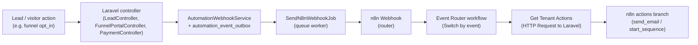

## Automation & n8n — Opt‑in and Sequences (Team Overview)

This document explains, in plain language, **what we built for automation**, how **Laravel and n8n work together**, and **how tenants use it in the UI**. It is a high‑level summary that points to the deeper docs for details.

Related docs (read this one first):

- Implementation details: [automation-n8n-implementation.md](automation-n8n-implementation.md)
- n8n start_sequence tutorial: [workflow-n8n-start-sequence-branch-guide.md](workflow-n8n-start-sequence-branch-guide.md)
- Migrations reference: [automation-migrations-reference.md](automation-migrations-reference.md)

---

### Summary

- **Laravel** fires events (e.g. `lead.created`, `funnel.opt_in`) and sends a single webhook payload to **n8n** (router URL in `config/n8n.php`). Payload includes `event`, `tenant_id`, `lead`, `from_email`, etc.
- **n8n** receives the webhook, routes by `event`, then calls **Laravel** `POST /api/automation/tenant/run` with `event`, `tenant_id`, and payload. Laravel returns an **actions** array (`send_email` and/or `start_sequence` with compiled steps) and `from_email`.
- **Tenants** configure behaviour in the app: **Workflows** (trigger + optional funnel filter + action) and **Sequences** (ordered Email / Delay / SMS steps). Workflows with **Start Sequence** use a chosen sequence; optional **Funnel** limits opt‑in workflows to a specific funnel.
- **n8n** runs the actions: for `start_sequence` it splits steps, loops one-by-one, and routes each step to Send Email, Wait, or SMS. No change to n8n when adding new triggers—only Laravel workflow configuration and (if needed) passing `funnel_id` in the payload.

---

### 1. What this automation does

At a high level:

- When something happens in the app (e.g. **lead created**, **funnel opt‑in**), Laravel sends an **event** to n8n.
- n8n calls back into Laravel to ask: **“For this tenant and event, what should I do?”**
- Laravel looks at the tenant’s **Workflows** and returns an **actions array**:
  - `send_email` → send one email now.
  - `start_sequence` → run a **Sequence** (ordered Email / Delay / SMS steps).
- n8n then executes those actions:
  - Send emails using its SMTP account.
  - Wait between steps.
  - Send SMS via an external provider (when configured).

The behavior of the system is **driven by tenant configuration** in the Automation UI, not by hard‑coded flows.

---

### 2. End‑to‑end data flow (from Laravel to n8n and back)

At runtime the main path is:



1. **Event in Laravel**  
   - Controllers dispatch events using `AutomationWebhookService::dispatchEvent(...)`.  
   - Example events:
     - `lead.created`
     - `funnel.opt_in`
     - `lead.status_changed`
     - `payment.paid`
     - `payment.failed`
   - A row is written to `automation_event_outbox` and a `SendN8nWebhookJob` is queued.

2. **Outbound webhook to n8n**  
   - `SendN8nWebhookJob` POSTs JSON to the **single n8n router webhook** (see `config/n8n.php` and `N8N_USE_ROUTER`).
   - Payload includes:
     - `event` (e.g. `funnel.opt_in`)
     - `event_id` (for idempotency)
     - `tenant_id`
     - `lead` (id, email, name, status, assigned agent, created_by)
     - `metadata` / `steps` (if relevant)
     - `from_email` (tenant’s preferred automation sender)

3. **n8n router workflow**  
   - Webhook node receives the payload.
   - A Switch node (Event Router) routes by `body.event` into branches:
     - Branch for `lead.created`
     - Branch for `funnel.opt_in`
     - Branch for `lead.status_changed`
     - Branch for `payment.paid`
     - Branch for `payment.failed`

4. **Get Tenant Actions (HTTP → Laravel)**  
   - In each branch (e.g. `funnel.opt_in`), n8n calls:
     - `POST /api/automation/tenant/run`
   - Body contains:
     - `event` (same as webhook, e.g. `funnel.opt_in`)
     - `tenant_id`
     - `payload` (usually the entire `body` from the webhook)
   - Laravel authenticates using `X-Automation-Token` and then:
     - Finds **active, tenant‑scoped workflows** for that event.
     - Applies **optional filters**, e.g. for `funnel.opt_in` it can filter by `trigger_filters.funnel_id`.
     - Builds an **actions array**:
       - `send_email` → `{ type: "send_email", to, subject, body }`
       - `start_sequence` → `{ type: "start_sequence", sequence_id, sequence_name, steps: [...] }`

5. **n8n executes actions**  
   - `Split Actions` turns `actions[]` into 1 item per action.
   - `Is Start Sequence?` IF node:
     - `type === "send_email"` → handled by the existing email branch.
     - `type === "start_sequence"` → goes into the **start_sequence branch**.
   - In the start_sequence branch (see `docs/workflow-n8n-start-sequence-branch-guide.md` for step‑by‑step):
     - `Split Sequence Steps` → 1 item per step.
     - `Split In Batches` (loop) → processes steps **one by one** in order.
     - `Step Type` Switch routes each step:
       - `email` → **Sequence – Send Email**
       - `delay` → **Sequence – Wait**
       - `sms` → **SMS node** (optional).

---

### 3. Tenant‑side UX: how a marketer configures this

The Automation UI lives under **Automation** in the sidebar, for `account-owner` and `marketing-manager` roles. There are four main screens:

- **Overview** — stats + recent automation activity.
- **Workflows** — list of event‑based workflows.
- **Sequences** — list of multi‑step sequences.
- **Logs** — history of automation runs from `automation_logs`.

#### 3.1 Sequences (multi‑step flows)

Path: **Automation → Sequences → Create Sequence**.

- Opens the **Sequence Builder** (3 columns: Steps | Step editor | Settings).
- Sequence fields:
  - **Name** (required).
  - **Active** (default on).
- **Steps** (ordered list):
  - **Email**  
    - Subject, body, recipient (`lead.email` or `assigned_agent.email`) → stored in step `config`.
  - **Delay**  
    - Duration + unit (`minutes`, `hours`, `days`) → stored in step `config`.
  - **SMS**  
    - Message body + recipient (`lead.phone`) → stored in step `config`. n8n handles the actual SMS provider.
- Validation:
  - At least one step.
  - First step cannot be **Delay**.
  - Step `type` is one of `email`, `delay`, `sms`.

**Where it is in code:**

- UI: `resources/views/automation/sequences/builder.blade.php`
- Save/update logic: `AutomationController@storeSequence`, `AutomationController@updateSequence`
- Models: `AutomationSequence`, `AutomationSequenceStep`

#### 3.2 Workflows (when to run actions)

Path: **Automation → Workflows → Create Workflow**.

- A workflow is: **one trigger + one action**:

  - Triggers (stored as `trigger_event`):
    - `lead.created`
    - `funnel.opt_in`
    - `lead.status_changed`
    - `payment.paid`
    - `payment.failed`
  - Action types:
    - **Send Email** (`send_email`)
    - **Start Sequence** (`start_sequence`)
    - **Notify Sales Agent** (`notify_sales`) – still simple for now

- Workflow form (key fields):

  - **Workflow name** (required).
  - **Trigger** (required).
  - **Conditions (optional)**:
    - **Funnel (optional, Funnel opt‑in only)**  
      - Dropdown: Any funnel, or a specific funnel owned by the tenant.  
      - Stored in `trigger_filters.funnel_id`.  
      - Used by the API to scope `funnel.opt_in` workflows to a particular funnel.
    - **Conditions note** (free‑text; stored in `trigger_filters.note` for future use / display).
  - **Action**:
    - **Send Email**:
      - Recipient (lead / assigned agent).
      - Email subject & body.
    - **Start Sequence**:
      - Required **Sequence** dropdown (tenant sequences).
    - **Notify Sales Agent**:
      - No extra config right now; just a hint.
  - **Active** (checkbox).

**Where it is in code:**

- UI: `resources/views/automation/workflows/*.blade.php`
- Logic: `AutomationController@storeWorkflow`, `AutomationController@updateWorkflow`
- Model: `AutomationWorkflow` (`trigger_event`, `trigger_filters`, `action_type`, `action_config`).

---

### 4. How funnel‑specific workflows work

We now support **per‑funnel opt‑in workflows**:

- In the Workflow form, when **Trigger = Funnel opt‑in**:
  - The **Funnel** dropdown appears.
  - If a funnel is selected, we store its ID in `trigger_filters.funnel_id`.
- In the internal API (`TenantAutomationRunController::buildActions`):
  - For `event = 'funnel.opt_in'`, Laravel attempts to read `funnel_id` from the payload (top‑level or from `body.funnel_id`).
  - If present, it filters workflows:
    - Either **no funnel filter** (`trigger_filters->funnel_id` is null).
    - Or `trigger_filters->funnel_id` matches the payload `funnel_id`.

This allows patterns like:

- Workflow A — Funnel opt‑in, **Any funnel**, Start Sequence “Global Welcome”.
- Workflow B — Funnel opt‑in, **Funnel = Webinar Funnel**, Start Sequence “Webinar Nurture”.

When someone opts in on the Webinar Funnel, both A and B can run. For other funnels, only A runs.

---

### 5. Actions array — contract between Laravel and n8n

The internal API `POST /api/automation/tenant/run` returns a simple, explicit contract:

```json
{
  "actions": [
    {
      "workflow_id": 10,
      "type": "send_email",
      "to": "lead.email",
      "subject": "Welcome",
      "body": "Body text..."
    },
    {
      "workflow_id": 12,
      "type": "start_sequence",
      "sequence_id": 3,
      "sequence_name": "Optin Sequence",
      "steps": [
        { "step_order": 1, "type": "email", "recipient": "lead.email", "subject": "...", "body": "..." },
        { "step_order": 2, "type": "delay", "duration": 1, "unit": "days" },
        { "step_order": 3, "type": "sms", "recipient": "lead.phone", "body": "Short SMS..." }
      ]
    }
  ],
  "from_email": "tenant-or-owner@example.com"
}
```

Key points:

- `type` is always one of:
  - `"send_email"`
  - `"start_sequence"`
- For **send_email**:
  - `to` is a logical recipient (`lead.email` or `assigned_agent.email`). n8n resolves the actual address from the Webhook data.
- For **start_sequence**:
  - `steps[]` is fully compiled by Laravel using `AutomationSequence` and `AutomationSequenceStep`.
  - n8n does **not** need to know about database IDs; it just executes steps in order.
- `from_email` is resolved per tenant (profile setting or account owner email) and used by n8n in Send Email nodes.

Implementation details live in:

- `app/Http/Controllers/Api/TenantAutomationRunController.php`
- `app/Models/AutomationWorkflow.php`
- `app/Models/AutomationSequence.php`
- `app/Models/AutomationSequenceStep.php`

See `docs/automation-n8n-implementation.md` §5.5 for the full API description.

---

### 6. n8n start_sequence branch — quick summary

The detailed step‑by‑step instructions are in  
`docs/workflow-n8n-start-sequence-branch-guide.md`. Here is the “map” version so teammates know what exists.

- **Split Actions** — 1 item per action from `actions[]`.
- **Is Start Sequence? (IF)** — keeps only `type === "start_sequence"` items for this branch.
- **Split Sequence Steps** — 1 item per step.
- **Split In Batches / Loop** — processes steps **one at a time** so delays sit between emails.
- **Step Type (Switch)** — routes by step `type`:
  - `email` → **Sequence – Send Email**
  - `delay` → **Sequence – Wait**
  - `sms` → **SMS node** (provider‑specific).
- **Sequence – Send Email**:
  - To: from Webhook (`lead.email` or `assigned_agent.email`).
  - Subject/body: from `$json.subject` / `$json.body` (current step).
  - From: from `from_email` in Webhook or Get Tenant Actions response.
- **Sequence – Wait**:
  - Uses `$json.duration` and `$json.unit` (minutes/hours/days) from the step.

The same branch can be reused for any event that returns a `start_sequence` action (not only `funnel.opt_in`).

---

### 7. Operational notes and gotchas

- **Webhook response:**  
  If the Webhook node is configured to “Wait for response”, every execution path must eventually hit a Respond to Webhook node. Otherwise, requests can time out.

- **Sequences and workflows:**  
  Sequences can be shared by multiple workflows. The Sequence Builder shows which workflows use a sequence and warns when you try to pause a sequence that is used by active workflows.

- **Missing data:**  
  If a step refers to `lead.phone` but the lead has no phone number, the SMS node should skip or fail gracefully. Similar for email.

- **Extensibility:**  
  To add a new sequence step type in the future:
  1. Add it to the Sequence Builder UI and `AutomationSequenceStep` / `AutomationController::validateSequenceSteps`.
  2. Extend `TenantAutomationRunController::compileSequenceStep` to build the shape for that type.
  3. Add a new branch in the n8n **Step Type** Switch to handle it.

This document should give new team members a clear mental model of how **Automation + n8n** fit together, where to look in the code, and how changes in Laravel or n8n affect tenant‑visible behavior.

---

### Related documentation

| Doc | Purpose |
|-----|--------|
| [automation-n8n-implementation.md](automation-n8n-implementation.md) | Full implementation: config, events, API, UI spec, files changed. |
| [workflow-n8n-start-sequence-branch-guide.md](workflow-n8n-start-sequence-branch-guide.md) | Step-by-step n8n build: Split Actions, IF, Split Sequence Steps, Step Type, Send Email, Wait, SMS, loop. |
| [automation-migrations-reference.md](automation-migrations-reference.md) | Automation tables and migrations reference. |

