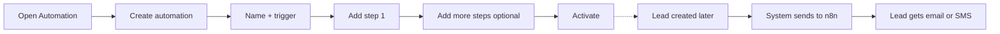

   # Automation — User Flow and Scenarios (Tenant Side)

This document describes **how the tenant (user) should use** the Automation feature and **how the system should behave** at each step. Use it to keep the product clear and to reduce user confusion.

---

## 1. Who uses it and what they want

**User:** Tenant (account owner or marketing manager).

**Goal:** When something happens (e.g. a new lead is added), the system automatically sends one or more messages (email or SMS) so the lead gets the right message at the right time, without manual work.

**Outcome:** The user defines **one automation** = one **trigger** (when it runs) + one or more **steps** (what to send and when). The system runs that automation whenever the trigger event happens.

---

## 2. High-level user flow (what the user does)

| Step | User action | System behavior |
|------|-------------|-----------------|
| 1 | Opens **Automation** in the menu | Shows list of automations; badge shows if automation service is connected. |
| 2 | Clicks **Create automation** | Opens create form (name, status, trigger). |
| 3 | Enters **name** (e.g. "Welcome new leads"), chooses **trigger** (e.g. "Lead created"), optionally **funnel** for "Funnel opt-in" | System saves workflow and redirects to edit page. |
| 4 | Adds **first step**: chooses **channel** (Email or SMS), fills **content**, sets **delay** (0 = immediate) | System saves step. Step appears in the list on the left. |
| 5 | Optionally adds **more steps** (e.g. second email after 5 minutes) | Each step is saved with position and delay. |
| 6 | Sets **status to Active** and saves | Workflow is now "on". For "Lead created", when a lead is created the system will send data to n8n. |
| 7 | (Later) A lead is created in CRM or via funnel | System builds payload and sends it to n8n; n8n sends the first email (or SMS when configured). |

---

## 3. Trigger: what the user selects and how the system behaves

| User selects | Meaning for the user | System behavior (current) |
|--------------|----------------------|----------------------------|
| **Lead created** | "Run this automation when a new lead is added in CRM (or via API)." | When a lead is created, Laravel sends the webhook to n8n with lead data and step content. n8n can send the first email (and more steps if the n8n workflow is built for it). |
| **Funnel opt-in** | "Run this automation when someone submits the opt-in form on a specific funnel." | Not wired yet: no webhook is sent when a user opts in. (UI and config ready; dispatch to be added in Laravel.) |
| **Lead status changed** | "Run this automation when a lead's pipeline status changes (e.g. new → qualified)." | Not wired yet: no webhook is sent when status is updated. (UI and config ready; dispatch to be added in Laravel.) |

**Rule to show the user:** Only **Lead created** runs automations today. Other triggers can be selected and saved, but the system will not send anything until those triggers are wired.

---

## 4. Channel: Email vs SMS — what the user sees and what the system does

### If the user selects **Email** for a step

| Field | Required? | User fills | System behavior |
|-------|-----------|------------|-----------------|
| **Sender name** | No | e.g. "Sales Team" | Sent to n8n; n8n can use it as "From" name. |
| **Subject** | No (but recommended) | e.g. "Welcome, {{ name }}" | For the **first** email step, Laravel replaces `{{ name }}`, `{{ email }}`, `{{ phone }}` and sends `email_subject` to n8n. n8n uses it as the email subject. |
| **Body** | **Yes** | Message text; can use `{{ name }}`, `{{ email }}`, `{{ phone }}` | For the first email step, Laravel replaces placeholders and sends `email_body` to n8n. n8n sends this as the email body. |
| **Delay (minutes)** | No (default 0) | 0 = send immediately; e.g. 5 = wait 5 minutes after previous step | Stored in the step; sent to n8n in the `steps` array. n8n can implement the wait and then send. |

**System behavior:** When the trigger fires (e.g. lead created), the system sends to n8n the lead's email plus the first email step's subject, body, and sender name (with placeholders already replaced). n8n sends that email. Any further steps (second email, etc.) are in the payload; n8n can run them using delays if the workflow is set up that way.

### If the user selects **SMS** for a step

| Field | Required? | User fills | System behavior |
|-------|-----------|------------|-----------------|
| **Sender name** | No | Optional (e.g. brand name); not always used for SMS | Stored and sent to n8n; n8n may use it as sender ID if the provider supports it. |
| **Subject** | No | Often left blank for SMS (SMS has no subject line) | Stored; can be ignored by n8n for SMS. |
| **Body** | **Yes** | Short message; can use `{{ name }}`, `{{ phone }}` | Stored and sent to n8n in `steps`. For SMS, n8n would use the lead's `phone` and this body (Laravel does not send SMS itself; n8n needs an SMS node e.g. Twilio). |
| **Delay (minutes)** | No (default 0) | Same as email | Stored; n8n can wait then send SMS. |

**System behavior:** Laravel does not send SMS. It saves the step and includes it in the webhook payload. When n8n has an SMS node configured (e.g. Twilio), it can read `phone` and the step body and send the SMS. So: **user can add SMS steps now; they will be used once n8n is set up for SMS.**

**Recommendation to reduce confusion:** In the UI you can show a short hint under the channel dropdown:  
- **Email:** "We'll send this to the lead's email. Use Subject and Body. Placeholders like {{ name }} are replaced automatically."  
- **SMS:** "Message will be sent to the lead's phone. Body only (no subject). SMS is sent by the automation service when configured."

---

## 5. Steps: one step vs multiple steps (recommended behavior)

**Recommendation:** Allow **multiple steps** per automation. That supports:

- One immediate email + one follow-up email after 5 minutes.
- One email + one SMS (e.g. email now, SMS after 10 minutes).

**Rules to make it clear to the user:**

| Rule | Explanation |
|------|--------------|
| **At least one step** | Every automation must have at least one step (email or SMS). Otherwise nothing is sent. |
| **First step (position 1)** | Runs first. If delay = 0, it runs as soon as the trigger fires. For **Lead created**, the system sends this step's content (and for the first **email** step, replaces placeholders and sends subject/body/sender to n8n). |
| **Later steps (position 2, 3, …)** | Each has a **delay in minutes** (after the previous step). The system sends all steps in the payload; **n8n** is responsible for waiting and then sending (e.g. Wait node + second Email node). So the user can add "Step 2: Email after 5 min" and the system stores it; the n8n workflow must implement the 5-minute wait and the second email. |
| **Order** | Steps run in order: Step 1 → (delay) → Step 2 → (delay) → Step 3, etc. |

**Optional simplification for MVP:** You could restrict to **one step per automation** to reduce confusion ("one trigger = one message"). Then the user creates a second automation for "follow-up after 5 min" (if you ever support "trigger: X minutes after lead created"). For most SaaS MVPs, **allowing 2–3 steps** (e.g. welcome email now + follow-up email after 5 min) is a good balance: flexible and still easy to explain.

---

## 6. Scenario A: "Welcome new lead" (one email, immediate)

**User goal:** When a new lead is added, send one welcome email right away.

| # | User action | System behavior |
|---|-------------|-----------------|
| 1 | Goes to Automation → Create automation | List page; then create form. |
| 2 | Name: "Welcome new leads"; Trigger: "Lead created"; Status: Draft | Workflow saved; redirect to edit. |
| 3 | Clicks Add step (or first step is already open) | Form: Content (Sender, Subject, Body) and Settings (Channel, Delay). |
| 4 | Channel: **Email**. Sender: "Sales". Subject: "Hi {{ name }}, welcome!". Body: "Thanks for signing up. We'll be in touch." Delay: 0 | Step saved. Placeholders in subject/body are stored as-is. |
| 5 | Clicks Save (workflow). Sets Status: **Active**. Saves settings | Workflow is active. |
| 6 | Later: someone creates a lead "Jane Doe", jane@example.com | Lead is saved. System gets active "Lead created" workflows and their steps. Builds payload with lead data and first email step (subject/body with {{ name }} replaced by "Jane Doe"). Dispatches job; job POSTs to n8n. n8n sends email to jane@example.com with subject "Hi Jane Doe, welcome!" and the body. |

**Result:** Lead receives one welcome email. No confusion: one trigger, one step, one email.

---

## 7. Scenario B: "Welcome email + follow-up after 5 minutes" (two steps)

**User goal:** Send welcome email immediately, then a second email 5 minutes later.

| # | User action | System behavior |
|---|-------------|-----------------|
| 1 | Creates automation "Welcome + follow-up"; Trigger: "Lead created" | Workflow saved. |
| 2 | Adds Step 1: Email, "Welcome!", body with {{ name }}, delay **0** | First step saved. |
| 3 | Adds Step 2: Email, "Quick follow-up", body, delay **5** | Second step saved. Both steps in list. |
| 4 | Activates workflow | Workflow active. |
| 5 | Lead is created | System sends payload to n8n with **both** steps (subject, body, delay for each). n8n sends the first email immediately. **n8n** must have a Wait (5 min) node and a second Email node that uses step 2 data; Laravel does not run the delay — it only sends the data. |

**Important for the user:** The system sends all step data to n8n. The **first** email is sent by n8n using the pre-filled subject/body. The **second** email (and any delay) must be implemented in the n8n workflow (Wait + second Send Email). So the user can design the sequence in Laravel; the automation service (n8n) executes the timing and the second message.

---

## 8. Scenario C: "Welcome email + SMS reminder" (Email step then SMS step)

**User goal:** Send welcome email now; send one SMS 10 minutes later.

| # | User action | System behavior |
|---|-------------|-----------------|
| 1 | Creates automation "Email + SMS"; Trigger: "Lead created" | Workflow saved. |
| 2 | Step 1: Channel **Email**, subject and body, delay 0 | Saved. |
| 3 | Step 2: Channel **SMS**, body only (e.g. "Hi {{ name }}, check your email!"), delay **10** | Saved. |
| 4 | Activates | Workflow active. |
| 5 | Lead is created | Payload includes both steps. n8n sends the first email. For the SMS step, n8n needs an SMS node (e.g. Twilio) that runs after a 10-minute wait and uses `phone` and step 2 body. If n8n SMS is not set up yet, the SMS step is stored and sent in the payload but no SMS is sent until n8n is configured. |

**Rule for the user:** "SMS steps are saved and sent to the automation service. SMS is only sent when the automation service (n8n) is configured with an SMS provider."

---

## 9. System behavior summary (quick reference)

| User choice | System behavior |
|-------------|-----------------|
| **Trigger: Lead created** | When a lead is created, payload is sent to n8n. First email step's content is sent with placeholders replaced; n8n sends that email. |
| **Trigger: Funnel opt-in / Lead status changed** | Stored and shown in UI; **no webhook is sent yet** until these are wired in Laravel. |
| **Channel: Email** | Subject + body (and sender name) are used. First email step: Laravel replaces {{ name }}, {{ email }}, {{ phone }} and sends to n8n; n8n sends the email. |
| **Channel: SMS** | Body (and optional sender) stored and sent in payload. Laravel does not send SMS; n8n sends when an SMS node is configured. |
| **Delay 0** | Step runs "immediately" (first step when trigger fires; later steps "after previous step" — n8n handles the wait). |
| **Delay > 0** | Stored and sent to n8n; n8n must wait that many minutes then run the next step. |
| **Status: Active** | Workflow is used when the trigger event happens (for Lead created: included when building the payload). |
| **Status: Draft / Inactive** | Workflow is not used; no payload is sent for it. |

---

## 10. What to show in the UI to reduce confusion

1. **On Create:** Short line under trigger: "Lead created = when a new lead is added. (Only this trigger runs automations for now.)"
2. **On Step form:** Under Channel dropdown: short hint for Email vs SMS (see section 4).
3. **On Step form:** Under Delay: "0 = right after the previous step (or immediately for the first step)."
4. **On Automation list:** Badge: "Automation service connected" / "Not connected" so the user knows whether emails will actually send.
5. **Optional:** If the workflow has no steps yet, show: "Add at least one step (email or SMS) for this automation to do anything."

This keeps the flow clear: **one trigger → one or more steps (each with channel and delay) → system sends data to n8n → n8n sends email (and SMS when configured).**
