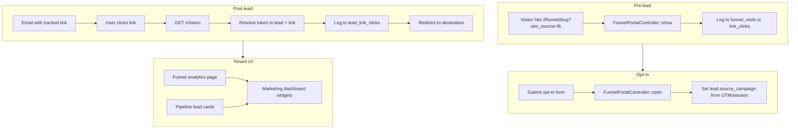

# Link Tracking & Source Attribution — Full Implementation Blueprint

This document is a **development guide and blueprint** for implementing link click tracking, visit attribution, and funnel analytics in the Laravel SaaS Sales Funnel project. Use it when you are ready to build the feature.

**Related docs:**
- [lead-source-tracking-guide.md](lead-source-tracking-guide.md) — User-facing guide (UTM, source_campaign, reporting).
- [automation-n8n-implementation.md](automation-n8n-implementation.md) — Automation events and n8n integration.

---

## 1. Scope and Goals

### 1.1 What We Are Building

| Piece | Description | Lives in |
|-------|-------------|----------|
| **Pre-lead visit/click logging** | When a visitor lands on a funnel URL with UTM (or referrer), log one record: tenant, funnel, source, timestamp. | Laravel only |
| **Source on lead at opt-in** | When they submit the opt-in form, set `lead.source_campaign` from UTM (or session). | Laravel only |
| **Known-lead link tracking** | Emails contain tracked links (token in URL). Click → resolve token → log lead_id, link name, count, time → redirect. | Laravel only |
| **Funnel analytics UI** | Tenant-facing: conversion funnel (Visits → Opt-ins → Pipeline → Won) and/or clicks by source. | Laravel (views + controllers) |
| **Pipeline enhancements** | On lead cards: show source and “Clicked: …” when we have link-click data. | Laravel (views) |
| **Optional automation** | Fire `lead.link_clicked` (or similar) to n8n so workflows can react. | Laravel + n8n |

### 1.2 Out of Scope (for This Blueprint)

- n8n workflow design (only “how to emit an event” is specified).
- Email delivery and template authoring (we only define how tracked URLs are generated and resolved).
- GDPR/consent UI (assume first-party, in-app tracking; add consent later if required).

---

## 2. Architecture Overview

- **Tracking and storage:** 100% Laravel (DB, controllers, redirect route).
- **Automation:** Optional; Laravel emits an event (e.g. `lead.link_clicked`) and sends payload to n8n; n8n workflows are configured separately.

---

## 3. Data Model

### 3.1 New Tables

#### 3.1.1 Funnel visits (pre-lead)

Stores each landing (or click) on a funnel page when UTM or referrer is present.

| Table name | Suggested: `funnel_visits` |
|------------|-----------------------------|
| `id` | bigInteger, primary key |
| `tenant_id` | foreignId → tenants |
| `funnel_id` | foreignId → funnels |
| `funnel_step_id` | nullable foreignId → funnel_steps (optional) |
| `utm_source` | string, nullable (e.g. facebook, youtube) |
| `utm_medium` | string, nullable |
| `utm_campaign` | string, nullable |
| `referrer` | string, nullable (HTTP Referer, truncated if needed e.g. 500 chars) |
| `visitor_id` | string, nullable (cookie/session visitor_xxx; optional for Phase 1) |
| `visited_at` | timestamp |
| Optional | `ip_hash` or `session_id` for simple deduplication |

**Indexes:** `(tenant_id, funnel_id, visited_at)`, `(tenant_id, utm_source, visited_at)`.

**Migration file name example:** `YYYY_MM_DD_HHMMSS_create_funnel_visits_table.php`

#### 3.1.2 Tracked links (known leads — Phase 2)

Defines the “link” that appears in emails (name + destination URL). Tenant- or campaign-scoped.

| Table name | Suggested: `tracked_links` |
|------------|----------------------------|
| `id` | bigInteger, primary key |
| `tenant_id` | foreignId → tenants |
| `name` | string (e.g. "Pricing", "Book a call") |
| `destination_url` | string (full URL to redirect to) |
| `campaign` | string, nullable (e.g. sequence name or campaign id) |
| `created_at` / `updated_at` | timestamps |

**Indexes:** `(tenant_id)`.

#### 3.1.3 Link click tokens (known leads — Phase 2)

Maps a short token to a specific lead + tracked link so we can log the click and redirect.

| Table name | Suggested: `link_click_tokens` |
|------------|--------------------------------|
| `id` | bigInteger, primary key |
| `token` | string, unique (e.g. 12–16 char random) |
| `tenant_id` | foreignId → tenants |
| `lead_id` | foreignId → leads |
| `tracked_link_id` | foreignId → tracked_links |
| `created_at` | timestamp (optional: expires_at for expiry) |

**Indexes:** unique on `token`.

#### 3.1.4 Lead link clicks (known leads — Phase 2)

One row per click on a tracked link by a known lead.

| Table name | Suggested: `lead_link_clicks` |
|------------|------------------------------|
| `id` | bigInteger, primary key |
| `tenant_id` | foreignId → tenants |
| `lead_id` | foreignId → leads |
| `tracked_link_id` | foreignId → tracked_links |
| `clicked_at` | timestamp |
| Optional | `click_number` (per lead+link), `ip_hash`, `user_agent` |

**Indexes:** `(tenant_id, lead_id, tracked_link_id, clicked_at)`, `(lead_id, tracked_link_id)`.

### 3.2 Models to Create

- **FunnelVisit** — belongs to Tenant, Funnel; optional FunnelStep, optional Visitor (if you add a visitors table later). Fillable: tenant_id, funnel_id, funnel_step_id, utm_source, utm_medium, utm_campaign, referrer, visitor_id, visited_at.
- **TrackedLink** — belongs to Tenant. Fillable: tenant_id, name, destination_url, campaign.
- **LinkClickToken** — belongs to Tenant, Lead, TrackedLink. Used to resolve `GET /r/{token}`.
- **LeadLinkClick** — belongs to Tenant, Lead, TrackedLink. Fillable: tenant_id, lead_id, tracked_link_id, clicked_at (and optional fields).

### 3.3 Existing Tables Used

- **leads** — already has `source_campaign`. No schema change required for Phase 1; we only set the value on opt-in.
- **funnels**, **funnel_steps** — for funnel_visits.funnel_id, funnel_step_id.

---

## 4. Phase 1 — Pre-Lead Tracking (Case 2)

### 4.1 Migration

1. Create migration `create_funnel_visits_table` with columns from §3.1.1.
2. Run `php artisan migrate`.

### 4.2 FunnelPortalController::show

**File:** [app/Http/Controllers/FunnelPortalController.php](app/Http/Controllers/FunnelPortalController.php)

**Where:** At the end of `show()`, after you have `$funnel` and `$step`, and **before** `return view(...)`.

**Logic:**

1. Read from request:
   - `utm_source`, `utm_medium`, `utm_campaign` (query params).
   - `referrer` from `$request->header('referer')` (optional; truncate to 500 chars).
2. If **any** of these are present (e.g. `utm_source` or `referrer`):
   - Create one row in `funnel_visits`:
     - `tenant_id` = `$funnel->tenant_id`
     - `funnel_id` = `$funnel->id`
     - `funnel_step_id` = `$step->id` (optional)
     - `utm_source`, `utm_medium`, `utm_campaign`, `referrer` from step 1
     - `visited_at` = now()
   - Optional: set or read a first-party cookie `visitor_id` (e.g. `visitor_` . Str::random(8)) and store in `funnel_visits.visitor_id` for future “journey” stitching. If you skip this in Phase 1, leave the column nullable and add later.

**Performance:** Use a single `FunnelVisit::create([...])`; no heavy logic. Optionally wrap in a try/catch so a DB failure does not break the page (log and continue).

### 4.3 FunnelPortalController::optIn — Set source_campaign

**File:** [app/Http/Controllers/FunnelPortalController.php](app/Http/Controllers/FunnelPortalController.php)

**Where:** After building `$lead` and before `$lead->save();`.

**Logic:**

1. Resolve source:
   - Prefer query params from the **current request**: `$request->query('utm_source')` (or `$request->input('source_campaign')` if you add a hidden field that forwards UTM from the page).
   - Optional: if you stored UTM in session on first visit (in `show`), fall back to `session('utm_source')` so opt-in from a second page still gets the original source.
2. If source is non-empty: `$lead->source_campaign = $source;` (normalize to string, max length 100 to match `leads.source_campaign`).

**Persistence:** `source_campaign` is already on `leads`; no migration. Ensure `Lead` model has `source_campaign` in `$fillable` (already present in the project).

### 4.4 Optional: Persist UTM in Session on First Visit

In `show()`, after logging the funnel visit, you can store UTM in session so that when the user moves to the next step (or submits opt-in on another step), the source is still available:

- `session()->put('funnel_utm_source', $request->query('utm_source'));` (and same for medium/campaign if needed).
- In `optIn()`, fall back: `$source = $request->query('utm_source') ?? session('funnel_utm_source');`.

Clear or overwrite when appropriate (e.g. new UTM on same session can update).

### 4.5 Phase 1 Reporting (Simple)

- **Total visits:** `FunnelVisit::where('tenant_id', $tenantId)->count()` (optional: date range).
- **Visits by source:** `FunnelVisit::where('tenant_id', $tenantId)->selectRaw('utm_source as source, COUNT(*) as total')->groupBy('utm_source')->orderByDesc('total')->get()`.

You can expose these in a simple report route and Blade view, or reuse in the Funnel analytics page (Phase 3).

---

## 5. Phase 2 — Known-Lead Link Tracking (Case 1)

### 5.1 Migrations

1. `create_tracked_links_table` — §3.1.2.
2. `create_link_click_tokens_table` — §3.1.3.
3. `create_lead_link_clicks_table` — §3.1.4.

Run migrations.

### 5.2 Token Lifecycle

- **Create token:** When sending an email (e.g. from n8n or a future Laravel mail layer), for each (lead, tracked_link) you generate a unique token, insert into `link_click_tokens`, and use URL `https://yourapp.com/r/{token}` in the email.
- **Resolve token:** On `GET /r/{token}`: look up `LinkClickToken` by `token`; get `lead_id`, `tracked_link_id`, `tenant_id`; create `LeadLinkClick`; redirect to `TrackedLink->destination_url`. Optionally increment a “click number” per (lead, tracked_link) and store it on `LeadLinkClick`.

**Token format:** Random string (e.g. 12–16 chars), URL-safe. Ensure uniqueness (unique index on `link_click_tokens.token`).

### 5.3 Redirect Route and Controller

**Route:** `GET /r/{token}` — public, no auth.

**Controller:** e.g. `LinkTrackController@redirect` or a single method in a dedicated controller.

**Logic:**

1. Find `LinkClickToken` by `token`. If not found, redirect to app homepage or a “link expired” page.
2. Load `TrackedLink` and `Lead` (and optionally check tenant is active).
3. Create `LeadLinkClick`: tenant_id, lead_id, tracked_link_id, clicked_at. Optionally compute `click_number` for this (lead_id, tracked_link_id) and save.
4. Optional: fire `lead.link_clicked` event and send to n8n (see §7).
5. Redirect: `redirect()->away($trackedLink->destination_url)` (external URLs must use `away()`).

**Performance:** Single read (token + link), one insert (lead_link_clicks), redirect. Keep it fast.

### 5.4 Where Tokens Are Created

- **Option A (later):** Laravel sends sequence emails; when building the email body, replace placeholders like `{{ tracked_link:Pricing }}` with `https://yourapp.com/r/{token}` where token is created for that lead + “Pricing” link. Requires a “tracked link” registry per tenant and a small helper that creates a row in `link_click_tokens` and returns the URL.
- **Option B:** n8n sends emails; Laravel exposes an API endpoint, e.g. `POST /api/tracked-link-url` with `tenant_id`, `lead_id`, `link_name` or `tracked_link_id`; Laravel creates a token and returns `{ "url": "https://..." }`; n8n inserts that URL into the email. Same table usage.

For the blueprint, assume a **service or helper** in Laravel: e.g. `LinkTrackingService::urlForLeadAndLink(Lead $lead, TrackedLink $link): string` that creates a `LinkClickToken` and returns the full URL.

### 5.5 Tracked Links CRUD (Optional but Recommended)

- **List/create/edit tracked links** per tenant (e.g. under Automation or Settings): name, destination_url, campaign. Store in `tracked_links`. No token creation here; tokens are created when generating email content.

---

## 6. Phase 3 — Tenant-Facing UI

### 6.1 Funnel Analytics Page (Conversion Funnel)

**Purpose:** Show funnel-style conversion: Visits → Opt-ins → In pipeline → Closed Won. Optionally filter or break down by source (Facebook, YouTube, etc.).

**Route:** e.g. `GET /analytics/funnel` or `/marketing/funnel-analytics`, under `role:account-owner,marketing-manager`. Add to [routes/web.php](routes/web.php) in the same middleware group as other marketing routes.

**Controller:** New method, e.g. `AnalyticsController@funnel` or `DashboardController@funnelAnalytics`. Resolve `tenant_id` from `auth()->user()->tenant_id`.

**Data:**

- **Visits:** Count of `FunnelVisit` for tenant (optional: by funnel_id, date range, utm_source).
- **Opt-ins:** Count of leads created via funnel (you may need to infer “from funnel” — e.g. leads with a given tag or created in a time window; or add `lead_source` = 'funnel' later). Simplest: total leads in tenant for the period, or count of `funnel_visits` that “converted” (harder without linking visit to lead). **Pragmatic:** use “lead count” for the period as proxy for opt-ins, or add a `source_type` on leads later (e.g. 'funnel' vs 'crm').
- **In pipeline:** Count of leads where `status` in ('new', 'contacted', 'proposal_sent').
- **Closed Won:** Count of leads where `status` = 'closed_won'.

**View:** Funnel-style visualization (e.g. horizontal bars or stacked funnel shape) with four stages. Optional: dropdown “By source” to filter by `utm_source` and show the same four numbers for that source. Use existing layout (e.g. [resources/views/layouts/admin.blade.php](resources/views/layouts/admin.blade.php) or the one used by [resources/views/dashboard/marketing.blade.php](resources/views/dashboard/marketing.blade.php)).

### 6.2 Marketing Dashboard Add-Ons

- **Widget: “Funnel link visits by source”** — Same query as §4.5 (visits by utm_source). Display as a small table or bar chart on [dashboard/marketing](resources/views/dashboard/marketing.blade.php). Reuse `DashboardController::marketing()` and pass a new variable, e.g. `$visitsBySource`.
- **Widget: “Top tracked links” (Phase 2)** — From `lead_link_clicks`: group by tracked_link_id, count clicks. Show link name and total clicks. Optional: distinct lead count.

### 6.3 Pipeline Lead Cards

**File:** View that renders the lead pipeline (kanban). Likely under `resources/views/leads/` or a partial used by the pipeline.

**Enhancement:** On each lead card, display:
- **Source:** `$lead->source_campaign` (e.g. “Facebook”, “YouTube”). Already on the model.
- **Link clicks (Phase 2):** If you have `lead_link_clicks`, show a short line like “Clicked: Pricing, Book a call” or “2 links” from `LeadLinkClick::where('lead_id', $lead->id)->with('trackedLink')->get()`.

---

## 7. Optional — Automation Integration

To let n8n react to link clicks:

1. **Event name:** e.g. `lead.link_clicked`.
2. **When:** In the redirect controller (§5.3), after creating `LeadLinkClick`, call the same pattern as existing automation: build a payload (tenant_id, lead_id, link name or tracked_link_id, clicked_at, click_number), then `AutomationWebhookService::dispatchEvent('lead.link_clicked', $payload)`.
3. **n8n:** Add a branch in the SaaS Event Router for `lead.link_clicked` and implement the desired workflow (e.g. notify sales, add to sequence). Payload contract: document in [automation-n8n-implementation.md](automation-n8n-implementation.md).

No new tables; reuse outbox and webhook job.

---

## 8. Files Checklist

### 8.1 Phase 1

| Action | File / artifact |
|--------|------------------|
| Create | `database/migrations/YYYY_MM_DD_HHMMSS_create_funnel_visits_table.php` |
| Create | `app/Models/FunnelVisit.php` |
| Modify | `app/Http/Controllers/FunnelPortalController.php` — log visit in `show()`, set source in `optIn()` |
| Create (optional) | `app/Http/Controllers/AnalyticsController.php` or add method in `DashboardController` for simple “visits by source” report |
| Create (optional) | View for “visits by source” or embed in existing marketing dashboard |

### 8.2 Phase 2

| Action | File / artifact |
|--------|------------------|
| Create | Migrations: `tracked_links`, `link_click_tokens`, `lead_link_clicks` |
| Create | Models: `TrackedLink`, `LinkClickToken`, `LeadLinkClick` |
| Create | `app/Http/Controllers/LinkTrackController.php` (or similar) — redirect and log |
| Create | `app/Services/LinkTrackingService.php` (or helper) — create token, return URL |
| Add route | `Route::get('/r/{token}', [LinkTrackController::class, 'redirect'])->name('link.track.redirect');` |
| Optional | CRUD for tracked links (controller + views + routes) |
| Optional | API endpoint for n8n to get tracked URL: e.g. `POST /api/tracked-link-url` |

### 8.3 Phase 3

| Action | File / artifact |
|--------|------------------|
| Create or extend | Controller method for funnel analytics page |
| Add route | e.g. `/analytics/funnel` or `/marketing/funnel-analytics` |
| Create | `resources/views/analytics/funnel.blade.php` (or under dashboard/marketing) |
| Modify | `DashboardController::marketing()` — pass `$visitsBySource`, optionally `$topTrackedLinks` |
| Modify | Marketing dashboard view — add widgets |
| Modify | Lead pipeline view/partial — show source and “Clicked: …” on cards |

### 8.4 Optional Automation

| Action | File / artifact |
|--------|------------------|
| Modify | `LinkTrackController` (or redirect handler) — after logging click, call `AutomationWebhookService::dispatchEvent('lead.link_clicked', $payload)` |
| Document | In [automation-n8n-implementation.md](automation-n8n-implementation.md): event `lead.link_clicked`, payload shape, and that n8n may add a branch for it |

---

## 9. Testing and Acceptance

### 9.1 Phase 1

- Visit `/f/{funnelSlug}?utm_source=facebook`. Assert one row in `funnel_visits` with utm_source = 'facebook', correct tenant_id and funnel_id.
- Visit without UTM: no row (or define policy: only log when at least one of utm_source, utm_medium, utm_campaign, referrer is set).
- Submit opt-in from a page that was loaded with `?utm_source=youtube`. Assert lead has `source_campaign` = 'youtube'.
- Report: “Visits by source” shows Facebook and YouTube with correct counts.

### 9.2 Phase 2

- Create a tracked link and a token for a lead. Open `https://yourapp.com/r/{token}`. Assert one row in `lead_link_clicks`, and browser redirects to `destination_url`.
- Invalid token: redirect to homepage or error page, no insert.
- Optional: same link clicked again by same lead: second row in `lead_link_clicks`, click_number or count correct if implemented.

### 9.3 Phase 3

- Funnel analytics page loads and shows four stages with non-zero numbers when data exists.
- Marketing dashboard shows “visits by source” (and optionally “top links”).
- Pipeline lead cards show source and “Clicked: …” when data exists.

---

## 10. Order of Implementation (Summary)

1. **Phase 1:** Migration `funnel_visits` + model → `FunnelPortalController::show` (log visit) → `FunnelPortalController::optIn` (set source_campaign) → simple report or widget (visits by source).
2. **Phase 2:** Migrations `tracked_links`, `link_click_tokens`, `lead_link_clicks` + models → redirect route + controller (log + redirect) → service to generate token/URL → optional CRUD for tracked links, optional API for n8n.
3. **Phase 3:** Funnel analytics page (conversion funnel UI) → dashboard widgets → pipeline card enhancements.
4. **Optional:** Emit `lead.link_clicked` in redirect controller; document and add n8n branch.

This blueprint is self-contained so that development can proceed in the order above with minimal ambiguity. Update this doc if you change table names, add columns, or introduce new endpoints.
